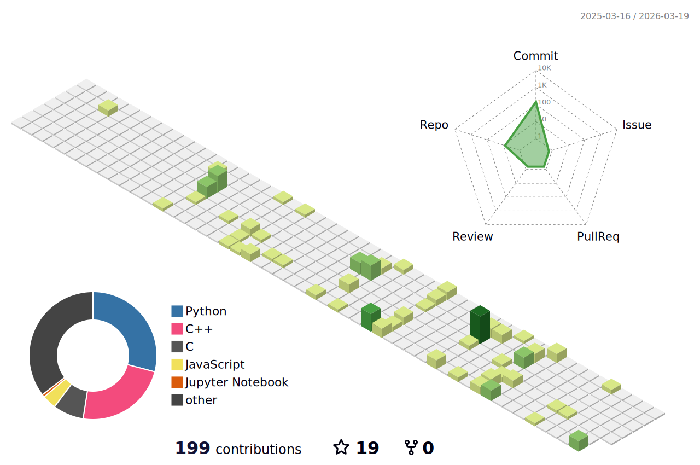

<h1 align="center">Hi 👋🏻 I'm Yashvardhan Jani </h1>

 

🎯A curious and passionate Computer Science Student @PDEU'28  I have keen interest in Machine Learning, AI Technology & Quantum Computing. Currently, I am focusing on exploring & learn New Skills and building a Projects.  Through exploring Competitive Programming, I resolute problem solving skill and to contribute to undertaking that inspire progress and yield success.  I welcome the opportunity to connect with like-minded individuals. Let's connect ✨ and I'm excited to hear about your ideas and see how we can create something great together! 🫱🏻‍🫲🏼
  
🖥️ You can check all my projects <a href="https://github.com/YashvardhanJani?tab=repositories" style="display:inline-block;padding:10px 20px;background-color:#337ab7;color:#ffffff;text-decoration:none;border-radius:5px;"> `Click me` </a>
  

# 💻 Tech Skills:
### Programming Languages

### Tools & Technologies

  
  
  
  
  
  

## Competitive Programming Profiles

  
  
  

## Connect with me

  |  |  |
  | ------------------------------------------------------------ | ------------------------------------------------------------ |
  |  | 

  

  ## 🏆 GitHub Trophies
  

    <a href="https://github.com/YashvardhanJani">
      <picture>
        <source media="(prefers-color-scheme: dark)" srcset="https://github-profile-trophy-ruddy.vercel.app/?username=YashvardhanJani&no-bg=true&row=2&column=6&margin-w=20&margin-h=20&theme=monokai">
        <source media="(prefers-color-scheme: light)" srcset="https://github-profile-trophy-ruddy.vercel.app/?username=YashvardhanJani&no-bg=true&row=2&column=6&margin-w=20&margin-h=20">
        
      </picture>
    </a>
  

  ## 📊 GitHub 3D Contributions
  

  

